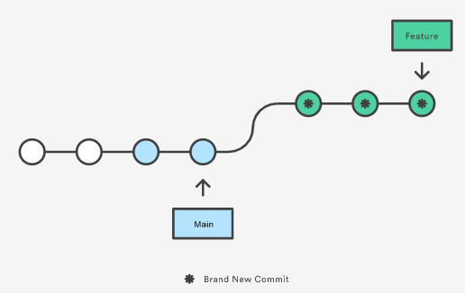
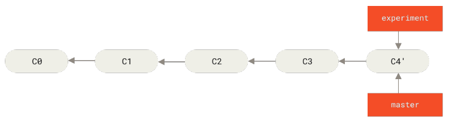

# Advanced Topics

## merge vs rebase

Merge and rebase are doing same thing in different ways and both of them integrate changes from a branch to another.

Let's say we have a feature branch from main as following shows:

  

Merge creates new commit with changes (and commit histroy of both branches) and add to target branch. The following shows merge main to feature branch:

  

Merging is non-destructive operation and existing branch are not changed in any way.

Rebase does the following steps:

- take away and save temporarily the commits after common commit
- fast forward to the new common commit
- re-apply each of saved commit and generate new one for each of them

The following diagram shows the result of a rebasing feature branch from main:

  

As you can see the commit history is altered.

### example

The following example [^1] shows the difference between merge and rebase:




> Often, you’ll do this to make sure your commits apply cleanly on a remote branch — perhaps in a
project to which you’re trying to contribute but that you don’t maintain. In this case, you’d do your
work in a branch and then rebase your work onto origin/master when you were ready to submit
your patches to the main project. That way, the maintainer doesn’t have to do any integration
work — just a fast-forward or a clean apply

***Principles***

- **Do not rebase commits that exist outside your repository and that people may have based
work on** [^1]
- **never push --force after rebase to main branch**
- dont use rebase on main branch coz it's destructive
- rebase in feature branch and merge (fast-forward) in main branch is called ***git flow***
- if you are not sure use merge

### resolve conflict

[here](https://git-scm.com/book/en/v2/Git-Branching-Basic-Branching-and-Merging) and [here](https://git-scm.com/book/en/v2/Git-Tools-Advanced-Merging) are good references for resolving conflicts. Strongly recommend to read them.

The following is a recap of the above references:

- Find the files with conflicts. These files will have conflict markers <<<<<<<, =======, and >>>>>>> in them. You can view conflicts by running ***git status*** or checking the files directly.

```bash
~/tests/project1 (dev4) $ git status
On branch dev4
Your branch is up to date with 'origin/dev4'.

You have unmerged paths.
  (fix conflicts and run "git commit")
  (use "git merge --abort" to abort the merge)

Unmerged paths:
  (use "git add <file>..." to mark resolution)
        both modified:   d.txt

no changes added to commit (use "git add" and/or "git commit -a")
```

- Open each file and determine how you want to resolve the conflicts. You'll need to choose which changes to keep and which to discard. Look for the content delimited by <<<<<<< and >>>>>>>.

```bash
cat d.txt
<<<<<<< HEAD
update10@d.txt
=======
update9@d.txt
>>>>>>> main
```

- Edit the file to remove the conflict markers and merge the changes as you choose. For example:

```bash
cat d.txt
update10@d.txt
update9@d.txt
```

- Save merged file and stage it:

```bash
git add d.txt
git merge --continue
git commit . -m "merged d.txt"
```

**TIPS:**

- Make sure you understand what is being changed before discarding or merging changes. Look at the file diffs to see the changes in each branch.
- If possible, combine non-overlapping changes from each contributor. But choose one contributor's changes as the base if changes edit the same area.
- Communicate with contributors whose changes you choose not to include and explain your reasoning. Collaboration will lead to better results.
- If conflicts are too complex or time-sensitive, consider temporarily stashing changes to return to and resolve conflicts later when you have more focus.
- You can choose to take one contributor's entire file as the resolution by simply keeping all of their content and commenting out the other contributor's markers. But only do this if you are comfortable those changes represent the correct resolution.
- Don't forget to commit your resolved files when done. Uncommitted changes will remain as "unmerged" in Git.  

## reset vs revert

***git reset***

git reset has three different modes:

- --soft

  Only moves the HEAD pointer and the staged snapshot and working directory are not altered in any way.

- It does not alter commit history.
- It does not change the staging area or index.
- It lets you quickly "undo" a commit while keeping your changes staged and worktree intact.

```bash
# usually used to squash commits, such as git rebase -i
git reset --soft HEAD~3
git commit . -m "squashed commits"
```

- --mixed
  
  The staged snapshot is updated to match the specified commit, but the working directory is  not affected. This is the default option. This is usually used to hold on commiting/push staged snapshot.

- --hard
  
  The staged snapshot and the working directory are both updated to match the specified commit.
  - Moves the current branch head to a different commit
  - Resets the index to match the commit
  - Discards any changes in the working directory
It effectively undoes all commits after the specified commit, and also undoes any changes in tracked files since that commit.
  
  ***Be very careful to do this and never do this in public repo***

***git revert***

git revert drop some commits by create new commit

## git rm/clean

- git rm update staging index as well compared to rm only
- git clean : get rid of unstaging files

## git reflog

The Git reflog is a history of changes to the local repository's HEAD. It records where HEAD was previously pointing to.

The reflog allows you to see where HEAD and branches have been in the past, and lets you recover lost commits. It's essentially a history of the value of HEAD over time.

Some common uses of the Git reflog are:

- Recovering lost commits. If you accidentally move HEAD and lose commits, you can find them again in the reflog.
- Checking past values of HEAD. This can be useful when debugging or trying to see the state of the repo at a previous point in time.
- Finding the last branch you were on. If you detach HEAD and can't remember what branch you were on before, the reflog contains that information.

To view the Git reflog, use the git reflog command:

```bash
git reflog

# output
65a79b0 (HEAD) HEAD@{0}: checkout: moving from main to 65a79b0
96227fb (origin/main, main) HEAD@{1}: checkout: moving from 96227fb5a68c7b23a9f8a16e397163ee802572da to main
96227fb (origin/main, main) HEAD@{2}: checkout: moving from 9bbc891b5b95743619f4c58e513f2eded71c8962 to HEAD@{5}
9bbc891 HEAD@{3}: checkout: moving from newdev to 9bbc891
c13e8e3 (newdev) HEAD@{4}: checkout: moving from c13e8e384b1b3dc35539c68c7cbfc1851ddf710c to newdev
c13e8e3 (newdev) HEAD@{5}: checkout: moving from main to c13e8e3
96227fb (origin/main, main) HEAD@{6}: checkout: moving from b87d5bd48114b18fadad04b0017bd68441004f3c to main
b87d5bd (tag: TEST2, tag: TEST1) HEAD@{7}: checkout: moving from main to TEST2
96227fb (origin/main, main) HEAD@{8}: checkout: moving from 65a79b0c100a04671d17147c2c9051f24408b26e to main
65a79b0 (HEAD) HEAD@{9}: checkout: moving from main to 65a79b0
96227fb (origin/main, main) HEAD@{10}: checkout: moving from dev4 to main
68b57a2 (origin/dev4, dev4) HEAD@{11}: commit: update
b87d5bd (tag: TEST2, tag: TEST1) HEAD@{12}: commit: update
```

Each entry shows:

- The commit SHA that HEAD pointed to
- The name of the reference (usually HEAD)
- The @{n} suffix indicating older entries
- The message showing what operation was done to that reference

The reflog only exists locally - it is not pushed to remote repositories. It keeps a history of the last few thousand changes of HEAD (default is 90 days worth of entries).

To recover a lost commit, you locate it in the reflog, then reset HEAD to it or create a branch at it. For example:

```bash
git reset --hard HEAD@{2}     # Set HEAD to where it was 2 moves ago 
git checkout -b NEW_BRANCH HEAD@{5} # Create branch at where HEAD was 5 moves ago
```

## detached HEAD state

"detached HEAD" state in Git means that your HEAD pointer is not a branch. This usually happens when you checkout a specific commit or tag.

To reattach your HEAD to a branch, you have a few options:

- checkout existing branch

```bash
git checkout main # switch to main branch
```

- create new branch from current commit

```bash
git checkout -b new_branch [COMMIT_HASH] # create new branch from current commit
```

- reset to existing branch

```bash
git reflog 
git checkout HEAD@{n} # n is the number of the commit you want to go back to
```

## submodule

Git submodules allow you to keep a Git repository as a subdirectory of another Git repository. This is useful when you want to have separate repositories for different parts/projects, but also want to keep them organized within one main repository.
Some common use cases for Git submodules are:

- Managing libraries or dependencies
- Including third party code in your project
- Keeping reusable components separate but still bundled

To add a submodule, you use the git submodule add command:
  
```bash
git submodule add https://github.com/user/repo.git path/to/submodule
```

This will:

- Add the submodule to your repo at the given path
- Pull down the submodule repo at that commit
- Create an entry in .gitmodules with the submodule info
- Create an entry in .git/config with the submodule info

To initialize submodules in a cloned repo, run:

```bash
git submodule update --init --recursive
```

This will pull down the correct versions of all submodules recorded in the main repo.

### example

```bash
[submodule "package/mypackage/src/3rdparty/cppzmq"]
    path = package/mypackage/src/3rdparty/cppzmq
    url = https://github.com/zeromq/cppzmq.git
[submodule "package/mypackage/src/3rdparty/variant"]
    path = package/mypackage/src/3rdparty/variant
    url = https://github.com/mpark/variant.git
[submodule "package/mypackage/src/3rdparty/googletest"]
    path = package/mypackage/src/3rdparty/googletest
    url = https://github.com/google/googletest.git
```

## comment

It's very important to write a good comment of commit not only for others to understand the commit but also for all to track the history of repository in the future if needed -- and it is definitely needed.

```text
commit eb0b56b19017ab5c16c745e6da39c53126924ed6
Author: Pieter Wuille <pieter.wuille@gmail.com>
Date:   Fri Aug 1 22:57:55 2014 +0200

   Simplify serialize.h's exception handling

   Remove the 'state' and 'exceptmask' from serialize.h's stream
   implementations, as well as related methods.

   As exceptmask always included 'failbit', and setstate was always
   called with bits = failbit, all it did was immediately raise an
   exception. Get rid of those variables, and replace the setstate
   with direct exception throwing (which also removes some dead
   code).

   As a result, good() is never reached after a failure (there are
   only 2 calls, one of which is in tests), and can just be replaced
   by !eof().

   fail(), clear(n) and exceptions() are just never called. Delete
   them.
```

[here](https://cbea.ms/git-commit/) is a good post on how to write a good comment of commit.

[^1]: [git merge vs rebase](https://git-scm.com/book/en/v2/Git-Branching-Rebasing)

[HOME](../README.md) | [PREV](basic_usage.md)| [NEXT](git_workflows.md)
