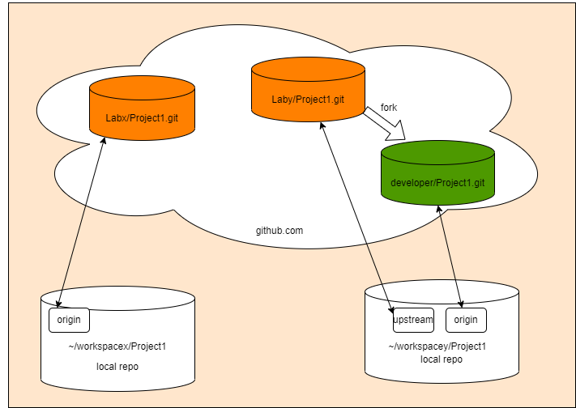

# Git fundamentals

## Integrity

Everything in Git is checksummed before it is stored and is then referred to by that checksum.

SHA-1 hash is used to generate 40-character string composed of hexadecimal characters (0–9 and a–f) that calculated based on the contents of a
file or directory structure in Git.

```bash
bf79d94f7674973921c80b3f477350d1e02814
```

> A higher probability exists that every member of your programming team will be attacked and killed by wolves in unrelated incidents on the same night than that Git will ever accidentally misidentify a single change in your project.

## Objects

There are three types of objects: blob, tree, commit. (tag is not a type of object -- it is just a reference to a commit object)

```bash
# list all objects
tree -a .git/objects
.git/objects
├── 1d
│   └── 0af9585bbca463698bbf2bea664ddf463c4a6a
├── 20
│   └── 4118454f2cc15b4c4ef8317d7d93ea2e783d65
├── 60
│   └── 4269e8750c600f584224a7ac8928faceba9336
├── 6b
│   └── 70f27936b34ef2593034ebd49cfd8d3d628492
├── 7b
│   └── 206957c992a23d94b535d91a4111cfeca9b1b4
├── 96
│   └── 1b3b587e5935237d7c2f62106687098b896de3
├── 98
│   └── 33ca3437610cc5f51013099b2110200e28a5b6
├── 9a
│   └── 0b5ccdd2ff446bbd1d929abdaa8f2b2db0bd3b
├── e5
│   └── 16d5e8e68a70aaa6a696bc8e7c714c88409b9f
├── f5
│   └── 4307eff53e460426420b7b69b821fc5cf6ebbd
├── info
└── pack
    ├── pack-daf1e9ac2feed87501669a9e31a92c4699a4b8a3.idx
    └── pack-daf1e9ac2feed87501669a9e31a92c4699a4b8a3.pack

12 directories, 12 files
```

The following diagram[^1] shows the relationship between the three types of objects:


## Index

The index is a binary file in .git/index that contains a sorted list of path names, each with permissions and the SHA-1 of a blob object.

```bash
# list all objects
git ls-files --stage
100644 1d0af9585bbca463698bbf2bea664ddf463c4a6a 0 README.md
```

## Areas and states

There are three areas in local workspace that contain git objects in different states:

### workspace areas


### workspace areas transition

- modified file, not staged , not commited , in work directory
- staged file, ready to commit , in staging area
- commited file, in local database


### file life cycle


## Branches

Branches are just pointers to a commit object.

The following diagram[^2] shows different branches in a repository:


## Tags

Tags are also pointers to a commit object. They provide a way to mark specific commits in your Git repository that can be used as:

- Versioning releases of your software (v1.0.0, v2.0.0, etc)
- Indicating stable releases, beta versions, etc
- Marking deployments of your app
- Creating named checkpoints that can be revisited later

```bash
# list all tags
git tag -l
INIT_DRAFT # one tag in this repo

# show tag object sha1
cat .git/refs/tags/INIT_DRAF
055918dbe5766054089f4ae31bdee897c174de54

# cat tag object type
git cat-file -t 055918dbe5766054089f4ae31bdee897c174de54
tag

# cat tag object content
git cat-file -p 055918dbe5766054089f4ae31bdee897c174de54
object 7340fbdaa5d24652a66ad183a0e5382b7ad7d8d7
type commit
tag INIT_DRAFT
tagger fengbin dong <fengbin.dong@spirent.com> 1684226732 +0800

tag for first draft

```

## Repos in github

  

- origin
        - default remote repo (or forked repo)
- master/main
        - default branch of repo
- upstream
        - the repo that fork from

[^1]: <https://www.freecodecamp.org/news/content/images/2020/12/image-41.png>
[^2]: <https://www.freecodecamp.org/news/content/images/2020/12/image-48.png>

[HOME](../README.md) | [PREV](what_is_git.md) | [NEXT](git_internals.md)
