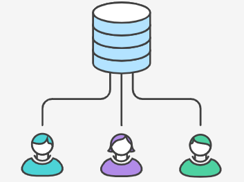
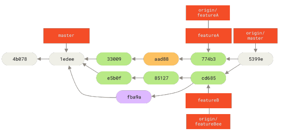
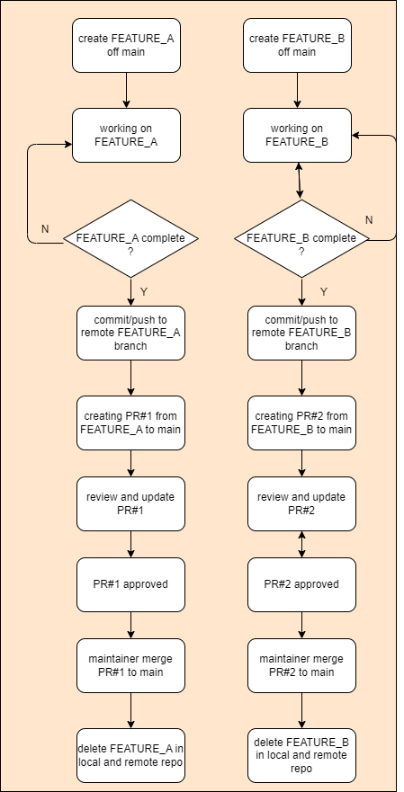
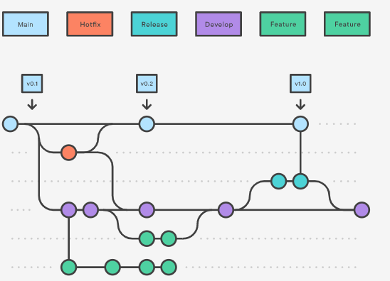
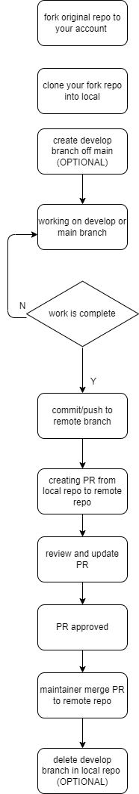

# Git workflows

A Git workflow is a set of conventions and procedures for collaborating on a Git project. The specific processes will depend on the needs of your team and project. But having any standardized workflow provides benefits around onboarding, collaboration, release management, and optimizing development.

It typically defines:

- Which Git branches to use
- The process for feature development
- Code review and validation processes
- Environment management
- Release procedures

The major types of Git workflows are:

- Centralized flow
  - Very simple, only using a main and optionally dev branch
- Feature branch flow
  - where developers work on features in isolated branches, then merge them into the main branch when ready.
  - It's a popular workflow for projects that use CI/CD
- Gitflow
  - Like Feature branch workflow but scalable, separating release, feature and develop branches
- Gitlab flow
  - Like Gitflow but simpler, focusing on a linear master branch and short-lived feature branches
- Forking flow
  - Great for public open source projects where anyone can fork and contribute

## Centralized workflow

With centralized workflow all contributors are pushing commits into same branch.

This workflow applies to small team.



## Feature branch workflow

Branches are created for business domain feature sets. Subteams work on different branches and maintainer integrates these feature branchs when they are ready.



### workflow (feature branch)



**TIPS:**

- Keep features small and separated to make merging and troubleshooting easier.
- Use clear branch naming conventions like "feature/new-login" or "bugfix/issue-423".
- Limit the number of commits on a feature branch to keep the branch up-to-date with main.
- Each developer works on a dedicated feature branch. No shared feature branches.
- Test thoroughly on the feature branch before merging to main.
- Delete feature branches after merging to keep the repository clean.
- For larger features, you can merge the feature branch into main multiple times keeping the branch up-to-date with main.
- Use Git rebasing to synchronize a feature branch with the main branch. But avoid rebasing branches that have already been shared with others.

## Gitflow workflow

Basically Gitflow is derived from Feature branch workflow with some conventions.

It defines main/develop/hotfix/feature branches for different purposes and there are some rules defined on how to work with these branches during different period of project.

- main
  - Contains production-ready code, updated only from release branches.
- develop
  - Contains latest delivered development changes for the next release. Updated from feature branches and merged into release branches.  
- feature
  - For developing new features, created from develop
- release
  - For preparing production releases, created from develop
- hotfix
  - For quick patches to production, created from main



[here](https://www.atlassian.com/git/tutorials/comparing-workflows/gitflow-workflow) has detailed information

## Forking workflow

With forking workflow every developer has his/her own server-side repository as remote/origin. This local server-side repository is forked from another centralized server-side repository -- remote/upstream.

Developers can use any applicable workflow in their own local repository and once commit is ready a pull request can be generated for remote/upstream to merge.

### workflow (forking workflow)



### rebase to upstream

Rebase to upstream is a common operation in forking workflow. It's used to synchronize local repository with upstream. For actively developed repository, it's recommended to rebase to upstream frequently.

The following is the steps to rebase to upstream:

```bash
# add upstream as remote
git remote add upstream <upstream_repo_url> # this is only needed once

# fetch upstream
git fetch upstream

# rebase to upstream
git rebase upstream/main # if it's not main, replace it with the correct branch name

```

## create PR in github

[here](https://docs.github.com/en/pull-requests/collaborating-with-pull-requests/proposing-changes-to-your-work-with-pull-requests/creating-a-pull-request) has detailed information

[HOME](../README.md) | [PREV](advanced_topics.md) | [NEXT](code_review.md)
