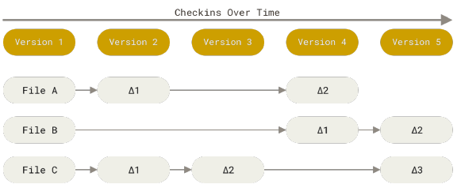
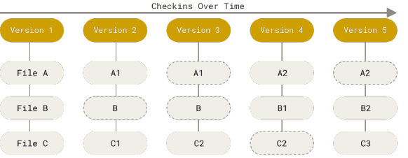

# What is git

## Background

- born for linux kernel version control
- known as following advantages:
  - speed (nearly every operation is local)
  - simple desgin
  - strong support for non-linear development (thouands of parallel branches)
  - fully distributed
    - there is no client or server. repository is just a folder no matter it is local or remote such as github
  - able to handle large projects  (speed/data size)

## Snapshots not differences

The following figures[^1] show the difference between Git and other VCS regarding to how to storage changes.

- **storing data as changes to a base version of each file**

- **storing data as snapshots of the project over time**

[^1]: <https://github.com/progit/progit2>

[HOME](../README.md) | [NEXT](git_fundamentals.md)
